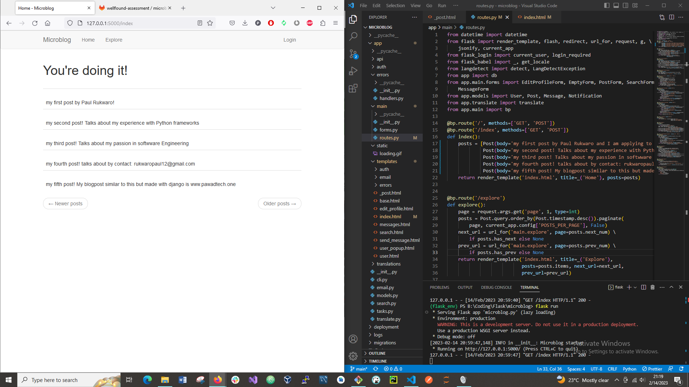

# Welcome to Wellfound's microblog assessment!

## Goal

Your task is to update the home page of this Flask app to display all of the rows in the blog posts table instead of just the static single row.

  

## Paul Rukwaro submission

Please find the  here. The only change I did was on the index.html which is the rendered template for the post function module. The  was used to get all the declared posts in one page. In an actual real project going to production, the posts needs to come from a model either class or functional that is fetching directly from a database.

I have made a blog post page with Django which is almost similar to Flask which can be found one www.pawadtech.one where I included many more functions of the blog posts that I see were in the process of being made for the microblog like display user's specific posts, authentication, multiple users with priviliges, pagination, among others.
